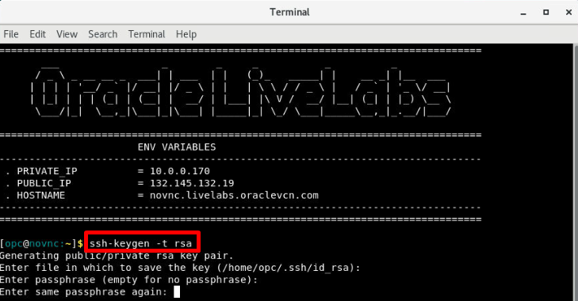

# Creación de maquinas virtuales

Esta sección contiene 2 partes:
- [Máquinas Virtuales](#aprendamos-un-poco-sobre-lo-que-es-una-vcn)
- [Laboratorio 3](#laboratorio-2-exploremos-una-vcn)

## Aprendamos un poco sobre las máquinas virtuales 

Oracle Cloud Infrastructure permite aprovisionar y gestionar hosts de cómputo conocidos como instancias. Puedes crear instancias según sea necesario para satisfacer tus requisitos de cómputo y aplicaciones. Después de crear una instancia, puedes acceder a ella de forma segura desde tu computadora, reiniciarla, adjuntar y desvincular volúmenes y cerrarla cuando ya no la necesites. Esto proporciona flexibilidad y escalabilidad para satisfacer las necesidades de tu infraestructura de TI en la nube.

Para saber más, puedes consultar la documentación de OCI 🤓➡️ https://docs.oracle.com/en-us/iaas/Content/Compute/Concepts/computeoverview.htm

## Laboratorio 3: Creación de máquinas virtuales

En este laboratorio crearemos 2 máquinas virtuales. **Cada máquina virtual debe estar en un AD diferente**. Para ellos seguiremos los siguientes pasos:
- [Paso 1:]
- [Paso 1:]
- [Paso 1:]

### Paso 1: Crear un par de llaves SSH

1. Abrimos el escritorio remoto y el terminal 

  

2. Para crear el par de llaves usamos el comando:

   ```
   ssh-keygen -t rsa
   ```
   - Mantenga el nombre original de la llave (id_rsa) aprentando enter
   - El campo "Key Passphrase" es opcional

   

3. Para ver el contenido de la llave pública, ejecuta este comando:
   
   ```
   cat ~/.ssh/id_rsa.pub
   ```
  > **Note:** Si no sabes la combinación de teclas para el símbolo "~" (virgulilla), busca el símbolo y copialo en el área de transferencia del Escritorio Remoto. Luego de ello, pégalo dentro del terminal usando _clic derecho + pegar_. Puedes hacer esto para facilitar el copiado/pegado de texto entre tu escritorio y el escritorio remoto.

   

  * Selecciona y copia el contenido de la llave. Usaremos esto para la creación de las máquinas virtuales. Recuerda copiar el texto en el área de transferencia del Escritorio Remoto
    
    

  _Para la creación de la VM, usaremos una llave pública y para la conexión, usaremos la llave privada_

   
     
### Paso 2: Crear 2 máquinas virtuales Oracle Linux

1. En el menú 🍔, vamos a Compute ➡️ Instances

   
   
2. En "Compute", haz clic en _"Create Instance"_

   

    Estos serán los datos de tu instancia:
    * Nombre de tu instancia: VM-OracleLinux-AD2
    * Dominio de Disponibilidad: AD 2
    * Sistema Operativo: Oracle Linux 7.9
    * Tipo de Instancia: Máquina Virtual
    * Forma de la Instancia: AMD VM.Standard.E4.Flex
    * Elija el Archivo de Clave SSH: Inserta el archivo de clave pública SSH (.pub)
    * Compartimento de la Red de Nube Virtual: "Tu Compartimento"
    * Red de Nube Virtual: "Tu VCN"
    * Compartimento de Subred: "Tu Compartimento"
    * Subred: Subred Pública
  
      > **Note:** Recuerda que tus máquinas virtuales deben estar en ADs diferentes. Hay una máquina creada por defecto con el ambiente y que se encuentra en un AD en específico. Las nuevas máquinas deben ser creadas en los otros ADs que quedan
      

    _En el ejemplo, la máquina por defecto se encuentra en el AD1 así que las 2 nuevas máquinas deberán ser creadas en el AD 2 y el AD 3_
      
3. 

   
