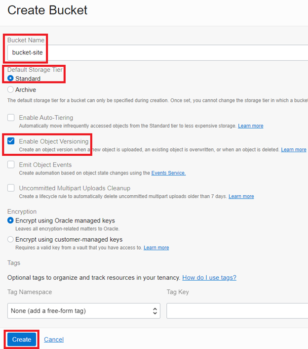
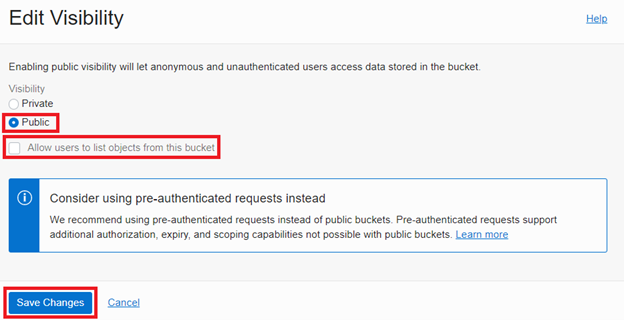
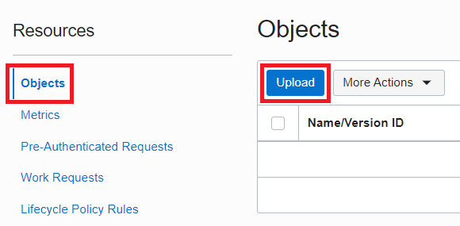
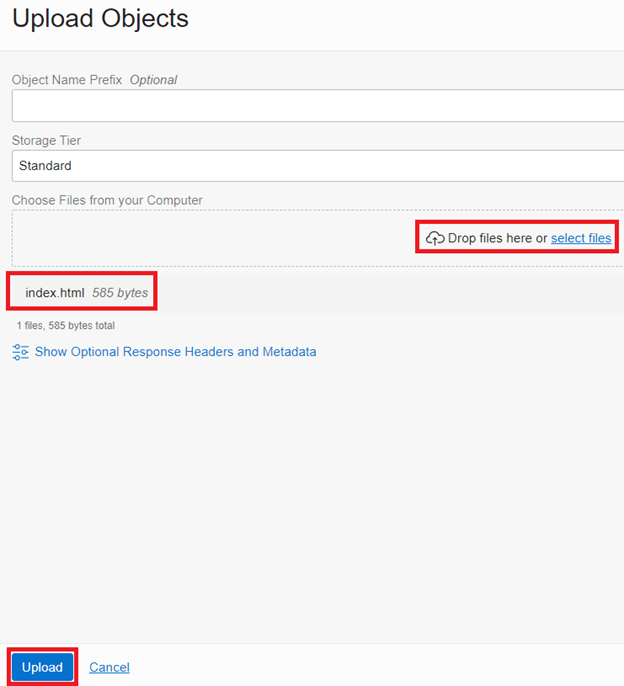
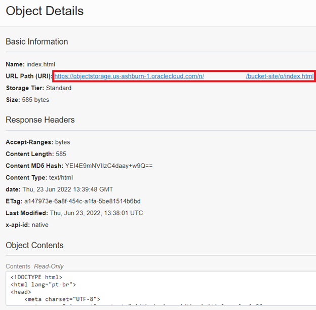
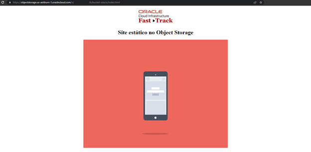

# Crear un Bucket 
## Introducción

rendimiento a escala en nube que ofrece durabilidad de datos confiable y rentable. El servicio Object Storage puede almacenar una cantidad ilimitada de datos no estructurados de cualquier tipo de contenido, incluidos datos analíticos y contenido enriquecido como imágenes y videos.

En este laboratorio aprenderá cómo trabajar con Object Storage dentro de Oracle Cloud Infrastructure.


*Tiempo estimado para este laboratorio: 10 minutos*.

### Objetivos

- Crear un Bucket en OCI.
- Crear un site estático utilizando un Bucket.


### Tarea 1: Crear un Bucket.

1. En el menú principal, de clic en la sección de **Storage** y posteriormente dirígete a **Buckets** 


2.	Luego haga clic en **Create Bucket**.


3. Complete el formulario como se muestra a continuación y haga clic en **Create**
a.	**Bucket Name:** "Ingrese un nombre para su Bucket".
b.	**Default Storage Tier:** Standard. 
c.	**Enable Object Versioning:** Activado.



### Tarea 2: Configuración de Bucket.
1.	En su Bucket, haga clic en el ícono de tres puntos y luego seleccione la opción **Edit**.


2.	Cambie la visibilidad a "Public", desmarque la opción "Allow users to list objects from this bucket" y haga clic en **Save Changes.**



### Tarea 3: Formatear el Block Volume y montar en la instancia

1. Ingrese a su Bucket.
2. Haga clic en **Objects**, en el menú del izquierdo, y de cluc en **Upload**
 
  

3.	Copie el html a continuación y cree el archivo index.html usando un editor de texto (bloc de notas) Nota: Recuerda guardar el archivo con la extensión ".html" 
    ```sh
        <!DOCTYPE html>
        <html lang="pt-br">
        <head>
            <meta charset="UTF-8">
            <meta name="viewport" content="width=device-width, initial-scale=1.0">
            <title>LAB: OCI FAST TRACK</title>
        </head>
        <body>
            <center> 
                    <h1>Site estático no Object Storage</h1> 
                       
        </body>
        </html>

    ```


4.	Una vez hecho esto, arrástrelo y suéltelo en el campo del depósito indicado y haga clic en **Upload**.

 

5.	Para el objeto, haga clic en el icono de tres puntos y haga clic en **View Object Details**.

 

6. Haga clic en el URI indicado y verifique si el sitio está disponible.
 

 

## Conclusión
En esta sesión aprendió sobre el almacenamiento de objetos en la práctica.

## Autoria
- **Autores** - Arthur Vianna, Lucas de Almeida, Luiz de Oliveira, Thais Henrique
- **Último Update Por/Date** - Arthur Vianna, Jun/2022
