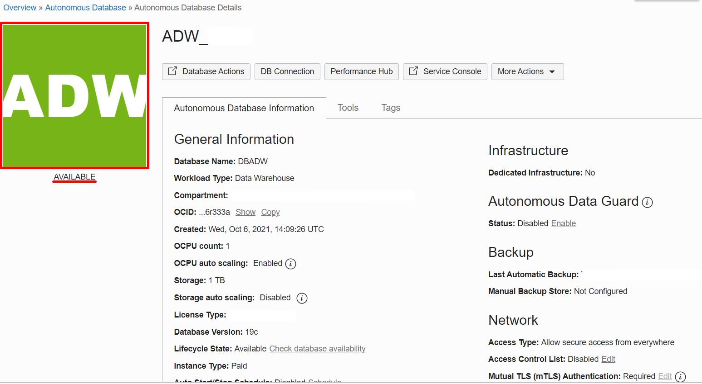
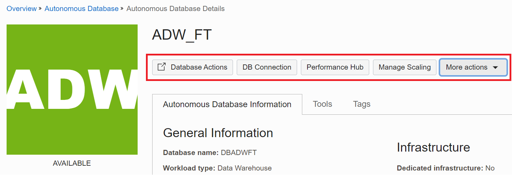
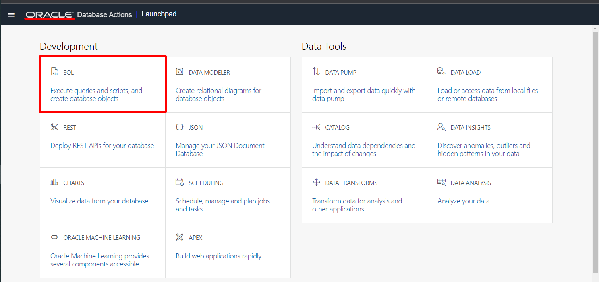
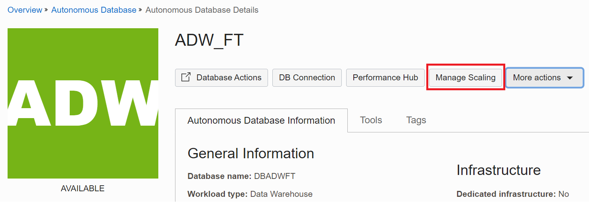
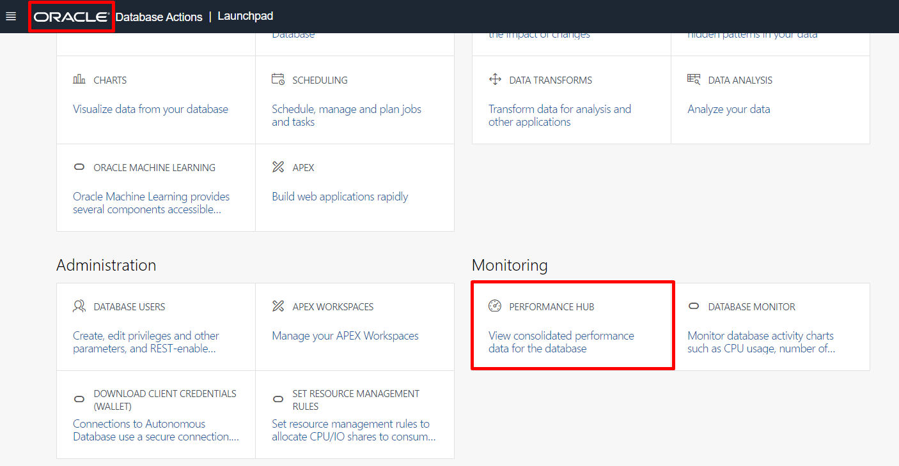
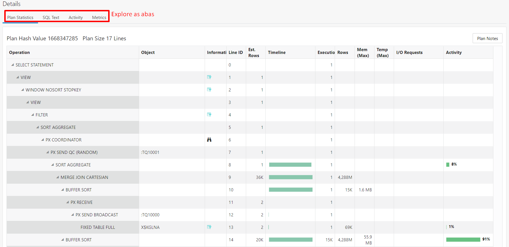
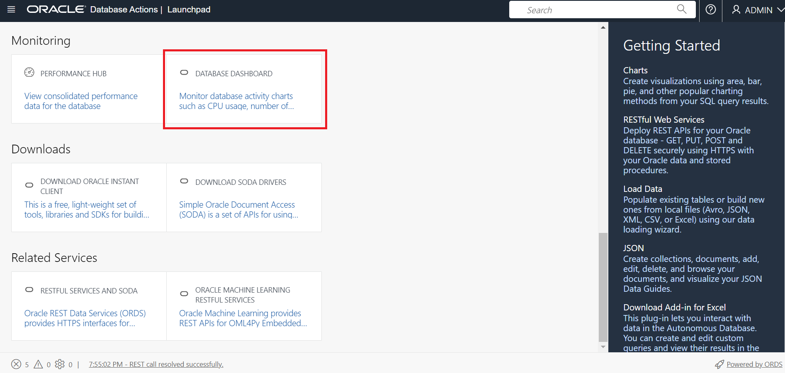

# Crear una Autonomous Database
## Introducción
### Overview

Oracle Cloud Infrastructure **Autonomous Database** es un entorno de base de datos preconfigurado y totalmente administrado con tres tipos de cargas de trabajo disponibles: Autonomous Transaction Processing, Autonomous Data Warehouse y Autonomous JSON. No necesita configurar ni administrar ningún hardware ni instalar ningún software. Después del aprovisionamiento, puede escalar la cantidad de núcleos de CPU o la capacidad de almacenamiento de la base de datos en cualquier momento sin afectar la disponibilidad o el rendimiento. La base de datos autónoma se encarga de la creación de bases de datos, así como de las siguientes tareas de mantenimiento:

- Copia de seguridad de la base de datos
- Parche de base de datos
- Actualización de base de datos
- Ajuste de base de datos

### Tipos de cargas de trabjo disponibles
Autonomous Database ofrece 3 tipos de carga de trabajo: 
- **Autonomos Transaction Processing** configura la base de datos para una carga de trabajo transaccional, con un sesgo hacia grandes volúmenes de datos de accesso aleatorio.
- **Autonomous Data Warehouse** Configura la base de datos para una carga de trabajo de soporte de decisiones o de almacenamiento de datos, con un sesgo hacia grandes operaciones de digitalización de datos.
- **Oracle Autonomous JSON** es un servicio de base de datos de documentos en la nube que simplifica el desarrollo de aplicaciones centradas en JSON.

*Tiempo estimado para este laboratorio: 25 minutos*.

### Objetivos

- Aprovisionamiento de una base de datos autónoma (almacén de Oracle Autonomous Data Warehouse).
- Explore los recursos disponibles de forma nativa dentro de la base de datos (Data Tools)
- Conozca el escalado de OCPU
- Explorar el Performance Hub

### Tarea 1: Proceso de creación de Autonomous Database

1. Haga clic sobre el menu principal que se encuentra en la parte izquierda de la pantalla y en la sección de Oracle Database, seleccione "Autonomous Database".<br>

2. Haga clic en "Create Autonomous Database", posteriormente será redireccionado al panel de despliegue de Autonomous Database.<br>

- Display Name: Asigne un nombre para su banco de datos.
- Database name: Asigne un nombre para su banco de datos.
- Choose a workload type : Para efectos de este ejercicio, seleccione **Data Warehouse**.
- Choose a deployment type: **Shared Infrastructure**.


- Choose database version: **19c**.
- ECPU count:**2**
- Storage (TB): **1**

*OCI TIP: Usted puede escoger entre 1 y 128 OCPU y entre 1 y 128 TBs de almacenamiento*<br>


- Create administrtor credentials: **Cree una contraseña para el usuario ADMIN**.
- Choose network access: **Secure access from everywhere**.

**Nota: La contraseña debe tener entre 12 y 30 caracteres y contener al menos una letra mayúscula, una letra minúscula y un número. La contraseña no puede contener comillas dobles (") ni el nombre de usuario "admin".**<br>


- Choose License and Oracle Database Edition: **Bring Your Own License (BYOL).**
- Choose an Oracle Database Edition: **Oracle Database Enterprise Edition (EE).**
- Finalice el proceso de creación haciendo clic en **"Create Autonomous Database"**

Ahora solo espera unos minutos y luego verás la pantalla:



**Su Base de datos autonoma ha sido aprovisionada exitosamente!**

### Tarea 2: Use los recursos nativos de Autonomous Database
La mayoría de las operaciones de bases de datos autonomas se pueden realizar desde los botones principales ubicados en la parte superior de la pantalla.



Esta nueva versión de Autonomous Database trae una versión ya cargada de SQL Developer a la que se puede acceder de la siguiente manera:
1. Haga clic en el botón **"Database Actions"**. Usted sera redireccionado a una pestaña. <br>


2.	Inicie sesión en el Data Warehouse con el nombre de usuario ADMIN y la contraseña que creó en la Tarea 1.

 

3. Seleccione la opción "Catalog" <br>


Utilice la página Catálogo para obtener información sobre las entidades disponibles en Oracle Autónoma Database. Puede ver los datos de una entidad, las fuentes de esos datos, los objetos derivados de la entidad y el impacto de los cambios en las fuentes en los objetos derivados.

4. Seleccione el esquema SH escribiendo: **owner=SH AND type=TABLE** y seleccione la tabla **SALES**

**Atención: asegúrese de que la opción ALL LOCAL OBJECTS esté seleccionada**


5. Explore los campos de visualización, linaje, impacto y estadísticas. Cuando termines de explorar, haz clic en el botón **Close**.


### Tarea 3: Escalamiento de ECPU y monitoreo de SQL Statements
1. Regrese a la pantalla principal haciendo clic en el logotipo de Oracle en la parte superior de la página y luego seleccione SQL

 
Ejecute consultas y scripts, y cree objetos en la base de datos a través de SQL Workseets

2.	Seleccione el esquema SH, copie el siguiente comando y péguelo en la hoja de trabajo SQL y luego haga clic en el botón 'Run Script' 
```SQL
select count(*) from dba_tables, dba_source;
select a.cust_first_name, count(a.country_id), sum(b.amount_sold) from sh.sales b, sh.customers a, sh.products where a.cust_id = b.cust_id group by a.cust_first_name;
```


3. Regrese a la pantalla "Autonomous Database Details", haga clic en el botón **More Actions** y seleccione **Managing Scaling**.



4. Aumente a **2 OCPU** y haga clic en el botón **Apply**


5. Luego de confirmar la escala, la cifra ADW en la consola mostrará la frase "**Scaling in progress**" y el Data Warehouse continuará en línea.


**Nota: Regrese a la pantalla SQL y verifique si las consultas aún se están ejecutando, si desea ejecutar una nueva selección.**

```SQL
select count(*) from (select * from dba_source, v$sqltext);
```

6. Regrese a la pantalla principal haciendo clic en el logotipo de Oracle en la parte superior de la página y luego seleccione **PERFORMANCE HUB**



Utilice la herramienta Performance Hub para analizar y ajustar el rendimiento de una base de datos autónoma seleccionada. Con esta herramienta, puede ver datos de rendimiento históricos y en tiempo real. Al visualizar datos históricos en Performance Hub, está viendo estadísticas recopiladas como parte de un periodo de dos instantes de tiempo su base de datos.

7. Seleccione **SQL MONITORING**, en esta sección usted podra ver la lista de declaraciones SQL realizadas <br>


8. Haga clic en el **ID SQL** de la consulta que desea explorar: <br>


9. Explore las otras pestañas, como **SQL Text**, **Actividades** y **Métricas**. Podemos obtener información muy importante como la CPU utilizada o cuánta memoria estamos utilizando para una determinado proceso.

 <br>


Otra forma de consultar las actividades de la base de datos es que, mientras ejecuta comandos, puede cambiar a la vista de actividades en el Database Dashboard dentro de la sección Database Actions en la consola de OCI y realizar un seguimiento de la actividad de la base de datos.

10. Regrese a la pantalla 'Autonomous Database Details' y haga clic en el botón **Database Actions**.<br>


11. Seleccione **Database Dashboard**.
 

12. Seleccione **Monitor**.
 

## Conclusion 
En esta sesión, aprendió cómo aprovisionar un Oracle Autonomous Data Warehouse. Exploró la herramienta Catalog nativa de esta base de datos autónoma y aprendió a monitorear el rendimiento y las sentencias SQL que se ejecutan en la base de datos.

## Autoria
- **Autores** - Arthur Vianna, Lucas de Almeida, Luiz de Oliveira, Thais Henrique
- **Último Update Por/Date** - Arthur Vianna, Jun/2022
